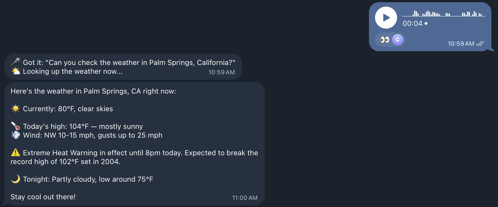
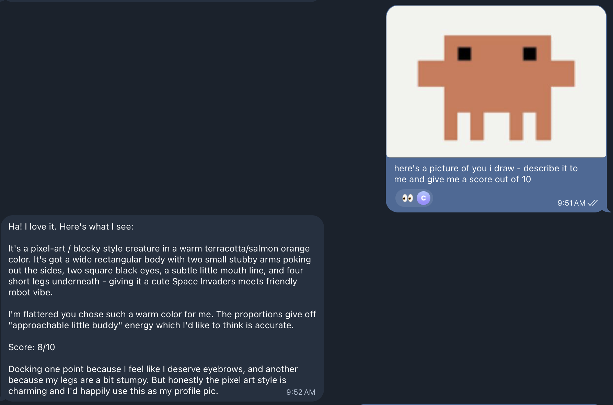
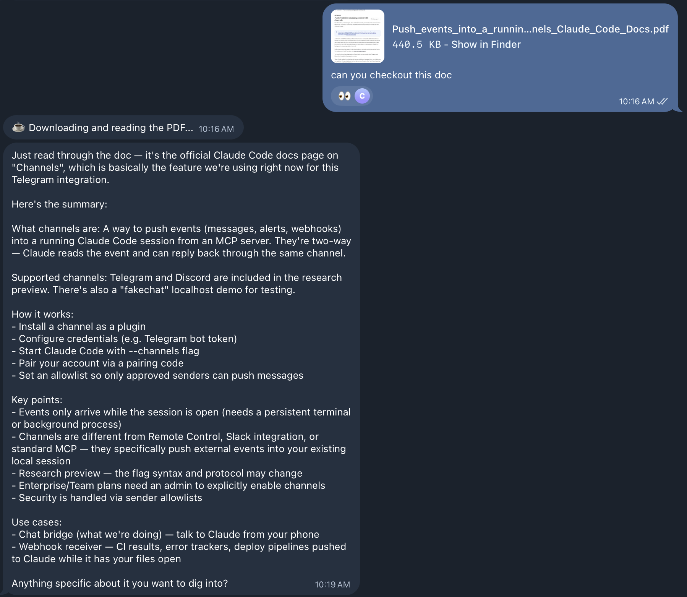
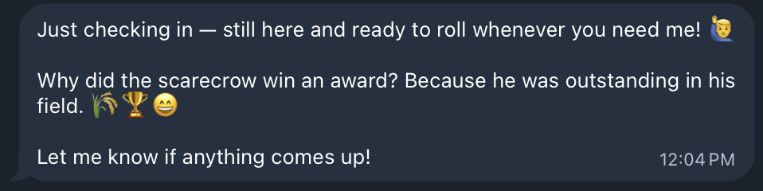
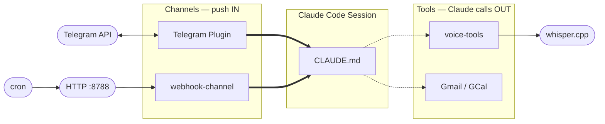

# claude-channels

**OpenClaw in ~250 lines of code.**

[OpenClaw](https://github.com/openclaw/openclaw) is a 328K-star personal AI assistant with 20,000+ commits, 79 directories, and adapters for 20+ messaging platforms. It's impressive engineering.

This repo does the same core job — an always-on AI assistant you talk to via Telegram, with voice transcription, scheduled briefings, and webhook triggers — in 254 lines of TypeScript and a 67-line behavior file. No gateway, no routing layer, no adapter framework.

The trick? **Claude Code channels.**

<table>
<tr>
<td align="center" width="50%"><br/><b>Voice Transcription</b><br/>Send a voice memo, get a weather report</td>
<td align="center" width="50%"><br/><b>Image Analysis</b><br/>Send a photo, Claude sees and responds</td>
</tr>
<tr>
<td align="center" width="50%"><br/><b>Document Processing</b><br/>Drop a PDF, get a full summary</td>
<td align="center" width="50%"><br/><b>Scheduled Check-ins</b><br/>Cron-triggered messages with personality</td>
</tr>
</table>

## What are channels?

Regular MCP servers are passive — Claude calls them when it needs a tool. Channels flip this: they actively **push events into** a running Claude Code session.

This is the key architectural difference. OpenClaw needs thousands of lines of gateway and routing code to orchestrate message flow between platforms and the AI. With channels, Claude Code *is* the gateway. A channel just pushes an event and Claude handles it.

This repo demonstrates both patterns:

| Component | Type | Lines | What it does |
|-----------|------|-------|--------------|
| `voice-tools` | MCP tool server | 81 | Transcribes voice messages via whisper.cpp. Claude calls it on demand. |
| `webhook-channel` | Channel server | 93 | HTTP listener that pushes webhooks into the session. Enables cron and external triggers. |
| `CLAUDE.md` | Behavior layer | 67 | Instructions that give Claude its personality, Telegram etiquette, and task routing. |
| `config/crontab` | Scheduler | 13 | Cron jobs that curl the webhook channel to trigger scheduled tasks. |
| `hooks/telegram_gate.py` | Claude Code hook | 90 | Deterministic enforcement: gates Telegram acknowledgment before tool use. |

## Architecture



> **Solid arrows** = channels push events into the session
> **Dotted arrows** = Claude calls tools on demand

## Project structure

```
claude-channels/
├── CLAUDE.md                        # Agent behavior instructions
├── .mcp.json                        # MCP server configuration
├── hooks/
│   └── telegram_gate.py             # Deterministic behavioral enforcement
├── tools/
│   └── voice-tools/
│       ├── package.json
│       └── src/
│           └── index.ts             # voice_transcribe tool (81 lines)
├── channels/
│   └── webhook-channel/
│       ├── package.json
│       └── src/
│           └── index.ts             # HTTP → channel events (93 lines)
└── config/
    └── crontab                      # Scheduled task definitions
```

## Prerequisites

- [Claude Code](https://docs.anthropic.com/en/docs/claude-code) with channels support
- [Bun](https://bun.sh) runtime
- [ffmpeg](https://ffmpeg.org) for audio conversion
- [whisper.cpp](https://github.com/ggerganov/whisper.cpp) for voice transcription
- A Telegram bot token (from [@BotFather](https://t.me/BotFather))

## Setup

### 1. Clone and install

```bash
git clone https://github.com/youruser/claude-channels.git
cd claude-channels

cd tools/voice-tools && bun install && cd ../..
cd channels/webhook-channel && bun install && cd ../..
```

### 2. Install whisper model

```bash
# macOS (Homebrew)
brew install whisper-cpp ffmpeg

# Download the English base model
mkdir -p /opt/homebrew/share/whisper-cpp/models
curl -L -o /opt/homebrew/share/whisper-cpp/models/ggml-base.en.bin \
  https://huggingface.co/ggerganov/whisper.cpp/resolve/main/ggml-base.en.bin
```

### 3. Configure .mcp.json

Update the `STT_MODEL` path in `.mcp.json` to point to your whisper model:

```json
{
  "mcpServers": {
    "voice-tools": {
      "command": "bun",
      "args": ["run", "tools/voice-tools/src/index.ts"],
      "env": {
        "STT_MODEL": "/opt/homebrew/share/whisper-cpp/models/ggml-base.en.bin"
      }
    },
    "webhook-channel": {
      "command": "bun",
      "args": ["run", "channels/webhook-channel/src/index.ts"],
      "env": {
        "WEBHOOK_PORT": "8788"
      }
    }
  }
}
```

### 4. Install the Telegram plugin

Inside any Claude Code session:

```
/plugin install telegram
```

Follow the prompts to enter your bot token and configure access as described in [Anthropic's guide](https://code.claude.com/docs/en/channels#supported-channels) (note when you get to the restart with channels step - see the following command)

### 5. Launch

```bash
claude \
  --dangerously-skip-permissions \
  --dangerously-load-development-channels server:webhook-channel \
  --channels plugin:telegram@claude-plugins-official
```

That's it. Claude is now:
- Listening for Telegram messages (text, voice, photos, documents)
- Transcribing voice messages via whisper.cpp
- Accepting webhooks on `http://127.0.0.1:8788`
- Ready for cron-scheduled tasks

## Testing

### Voice messages

Send a voice memo in your Telegram chat with the bot. Claude will:
1. Download the audio file
2. Call `voice_transcribe` to run whisper.cpp
3. Process the transcribed text and reply

### Webhooks

From another terminal:

```bash
# Health check
curl http://127.0.0.1:8788/health

# Trigger a daily briefing
curl -X POST http://127.0.0.1:8788/briefing \
  -H 'Content-Type: application/json' \
  -d '{"task":"daily_briefing"}'

# Trigger a check-in
curl -X POST http://127.0.0.1:8788/reconcile \
  -H 'Content-Type: application/json' \
  -d '{"task":"reconcile"}'
```

The webhook-channel pushes these as channel events. Claude reads the `meta.path` and follows the routing instructions in CLAUDE.md.

## Scheduled tasks

Install the crontab to enable scheduled triggers:

```bash
crontab config/crontab
```

Default schedule:
| Time | Route | Action |
|------|-------|--------|
| 7:00 AM, 5:00 PM | `/weather` | Weather check (alerts only if actionable) |
| 7:30 AM | `/briefing` | Daily briefing (email + calendar summary) |
| Every 6 hours | `/reconcile` | Check in with the user |
| 11:00 PM | `/eod` | End-of-day summary |

## How CLAUDE.md works

The `CLAUDE.md` file is the behavior layer. It's loaded into every Claude Code session in this directory and tells Claude:

- **Telegram etiquette**: Always react with 👀, send progress updates, final results as new messages (not edits, so the phone buzzes)
- **Voice handling**: The step-by-step flow for transcribing and responding to voice messages
- **Webhook routing**: What to do for each webhook path (`/briefing`, `/reconcile`, `/weather`, `/eod`)

This is where you customize the assistant's personality and capabilities. Want Claude to handle a new webhook route? Add a bullet point. Want different Telegram behavior? Edit the instructions. No code changes needed.

## Hooks: deterministic behavioral enforcement

CLAUDE.md instructions are probabilistic — Claude follows them most of the time, but not always. For behaviors that must be guaranteed, this project uses Claude Code hooks: executable scripts that fire on lifecycle events and can block or modify tool calls.

### The Telegram gate

`hooks/telegram_gate.py` implements a binary gate that prevents Claude from making any non-Telegram tool calls until it has acknowledged the incoming message with a react and status message.

How it works:
1. **UserPromptSubmit hook** — when a Telegram message arrives, writes a state file marking the gate as "closed"
2. **PreToolUse hook** — before every tool call, checks the gate. If it's closed and the tool isn't a Telegram communication tool (react/reply/edit_message), the tool call is blocked with an error explaining what to do first

This means Claude *cannot* call Gmail, web search, or any other tool before acknowledging the message — no matter which model is running (including Haiku).

### Setup

The hook wiring is in `.claude/settings.json` (committed). It references the script via `$CLAUDE_PROJECT_DIR` so it works on any machine without path changes.

The hook requires Python 3 (standard library only — no dependencies to install).

### Why hooks instead of prompts

CLAUDE.md instructions can be ignored under the right (or wrong) conditions. A hook is code: it either passes or it doesn't. For behaviors where "90% compliance" isn't enough — user-visible acknowledgment being the main one — hooks provide the guarantee that prompts cannot.

The tradeoff: hooks enforce *that* something happens; prompts guide *how* it happens. This project uses both: the hook enforces the initial acknowledgment, CLAUDE.md guides the quality and content of status messages.

## Extending

### Add a new webhook route

1. Add a route description to the `## Webhook Events` section in `CLAUDE.md`:
   ```
   - `/my-route` — Description of what Claude should do when this fires.
   ```

2. Trigger it:
   ```bash
   curl -X POST http://127.0.0.1:8788/my-route \
     -H 'Content-Type: application/json' \
     -d '{"your":"data"}'
   ```

That's it. No code changes — Claude reads the CLAUDE.md instructions and handles the new route.

### Add a new MCP tool

1. Create a new server in `tools/your-tool/`
2. Register it in `.mcp.json`
3. Add usage instructions to `CLAUDE.md`

### Add another channel

1. Create a new channel server in `channels/your-channel/` (declare `claude/channel` capability)
2. Register in `.mcp.json`
3. Add to the launch command: `--dangerously-load-development-channels server:your-channel`

## The 250-line breakdown

```
 81  tools/voice-tools/src/index.ts       # MCP tool: audio → whisper.cpp → text
 93  channels/webhook-channel/src/index.ts # Channel: HTTP POST → session event
 67  CLAUDE.md                             # Behavior: personality + routing
 13  config/crontab                        # Scheduler: cron → curl → webhook
───
254  total
```

Compare with OpenClaw's 20,000+ commits across 79 directories. Channels are a powerful abstraction.

## Docker

Run the whole thing in a self-contained Docker container. You SSH in to authenticate and launch Claude Code interactively. Cron runs inside the container for scheduled tasks.

### Build and start

```bash
docker compose build
docker compose up -d
```

### First-run setup

SSH into the container (password: `claude`):

```bash
ssh -p 2222 claude@localhost
```

Inside the container, authenticate and set up the Telegram plugin:

```bash
# 1. Navigate to the project
cd /app

# 2. Authenticate with your Claude Pro/Max account
claude auth login

# 3. Start a Claude Code session
claude

# 4. Add the official plugin marketplace
#    /plugin → Marketplaces → + Add Marketplace → anthropics/claude-plugins-official

# 5. Install the Telegram plugin
#    /plugin → Discover → telegram → install
#    Paste your bot token from @BotFather when prompted

# 6. Configure Telegram access
/telegram:configure <your-bot-token>
/telegram:access

# 7. Exit the session
exit
```

See [Anthropic's channels guide](https://code.claude.com/docs/en/channels#supported-channels) for full Telegram setup details.

### Launch Claude Code

From your SSH session, use `screen` so Claude survives SSH disconnects:

```bash
screen -S claude
cd /app
claude \
  --dangerously-skip-permissions \
  --dangerously-load-development-channels server:webhook-channel \
  --channels plugin:telegram@claude-plugins-official
```

Once Claude is running, detach with `Ctrl+A` then `D` — you can safely disconnect SSH and Claude keeps running.

To reattach later:

```bash
ssh -p 2222 claude@localhost
screen -r claude
```

### Testing webhooks

From a second SSH session into the container:

```bash
ssh -p 2222 claude@localhost

# Health check
curl http://127.0.0.1:8788/health

# Trigger a check-in (sends a Telegram message)
curl -X POST http://127.0.0.1:8788/reconcile \
  -H 'Content-Type: application/json' \
  -d '{"task":"reconcile"}'
```

### What's in the container

| Component | Details |
|-----------|---------|
| Base | Debian Bookworm (slim) |
| Runtime | Bun + Node.js 22 |
| AI | Claude Code v2.1.81 |
| STT | whisper.cpp v1.7.3 + ggml-base.en model |
| Audio | ffmpeg |
| Ports | 2222 (SSH), 8788 (webhooks) |
| Cron | Scheduled tasks pre-installed |

### Persistence

The `claude-data` volume mounts to `~/.claude/` inside the container, persisting auth, plugins, and Telegram credentials across container restarts.

## License

MIT
